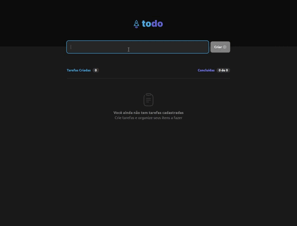

# TODO APP

Esse projeto foi desenvolvido como desafio no final do módulo de fundamentos de react do curso Ignite da [@Rocketseat](https://www.rocketseat.com.br/)

## ✨ Funcionalidades

* Criar todo
* Completar todo
* Deletar todo

<p >
  
</p>

## 🚀 Começando

Essas instruções permitirão que você obtenha uma cópia do projeto em operação na sua máquina local para fins de desenvolvimento e teste.
```
git clone https://github.com/lucashco/rocketseat-react-fundamentos-desafio.git
```

### 📋 Pré-requisitos

```
Node.js >= 12.2.0.
```

### 🔧 Instalação


Acesse a pasta baixada pelo git clone:

```
cd rocketseat-react-fundamentos-desafio
```

Instale os pacotes:

```
npm install
```

Rode o projeto:

```
npm run dev
```

Abra o navegado na porta [http://localhost:3000](http://localhost/3000)

## 🛠️ Construído com

* [ReactJS](https://reactjs.org/) - Biblioteca utilizada
* [ViteJS](https://vitejs.dev/) - Ferramental

## ✒️ Autor

* **Lucas Castilho** - *Desenvolvimento* - [lucashco](https://github.com/lucashco)
* **Lucas Castilho** - *Documentação* - [lucashco](https://github.com/lucashco)

---
⌨️ com ❤️ por [Lucas Castilho](https://gist.github.com/lucashco) 😊